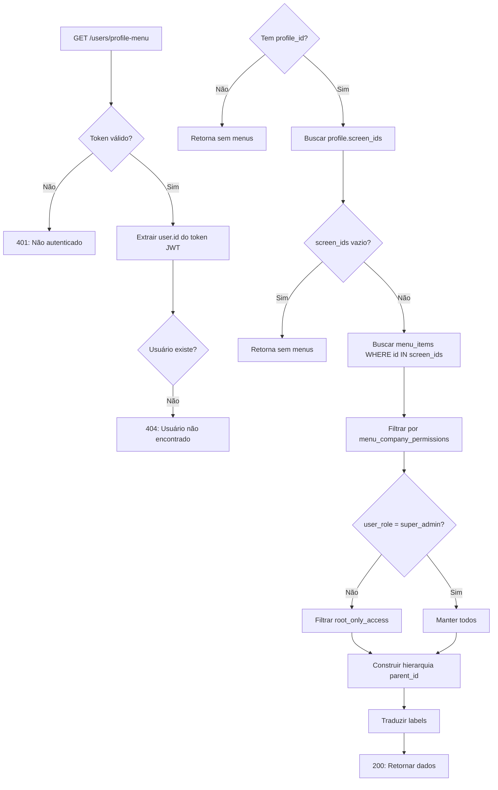

# 🎯 Endpoint: User Profile Menu

## 📋 Visão Geral

Endpoint criado para buscar o perfil de um usuário e os menus aos quais ele tem acesso, baseado nas permissões do seu perfil. Este endpoint é essencial para o fluxo de login, permitindo carregar dinamicamente o menu da aplicação de acordo com as permissões do usuário.

---

## 🔗 Endpoint

```
GET /api/v1/users/profile-menu
```

### 🔒 Segurança
✅ **Autenticação Requerida** - Bearer Token JWT  
✅ **Autorização Automática** - Usa o ID do usuário autenticado (`req.user.id`)  
✅ **Isolamento de Dados** - Cada usuário acessa apenas seus próprios dados

### Parâmetros

#### Headers
| Header            | Tipo   | Obrigatório | Descrição                                      |
|-------------------|--------|-------------|------------------------------------------------|
| `Authorization`   | string | ✅ Sim      | Bearer Token JWT                               |
| `Accept-Language` | string | ❌ Não      | Idioma da resposta (pt-BR, en-US, es-ES)       |

---

## 📊 Resposta

### Status 200 - Sucesso

```json
{
  "success": true,
  "message": "Perfil e menus carregados com sucesso",
  "data": {
    "user": {
      "id": 1,
      "fullName": "João Silva",
      "email": "joao@empresa.com",
      "role": "user",
      "companyId": 1,
      "profileId": 2,
      "profileName": "Atendente"
    },
    "profile": {
      "id": 2,
      "name": "Atendente",
      "translations": {
        "pt-BR": "Atendente",
        "en-US": "Support Agent",
        "es-ES": "Agente de Soporte"
      },
      "screenIds": ["2", "3", "6"]
    },
    "menus": [
      {
        "id": "2",
        "label": "Dashboard",
        "icon": "dashboard",
        "route": "/dashboard",
        "orderPosition": 1,
        "parentId": null,
        "isActive": true,
        "visibleToAll": false,
        "rootOnlyAccess": false,
        "svgColor": "#1976d2",
        "backgroundColor": null,
        "textColor": null,
        "children": [
          {
            "id": "3",
            "label": "Análises",
            "icon": "analytics",
            "route": "/dashboard/analytics",
            "orderPosition": 1,
            "parentId": "2",
            "isActive": true,
            "visibleToAll": false,
            "rootOnlyAccess": false,
            "svgColor": null,
            "backgroundColor": null,
            "textColor": null,
            "children": []
          }
        ]
      }
    ]
  }
}
```

### Status 401 - Não Autenticado

```json
{
  "success": false,
  "message": "Token inválido ou expirado",
  "error": "Unauthorized"
}
```

### Status 404 - Usuário Não Encontrado

```json
{
  "success": false,
  "message": "Usuário não encontrado",
  "error": "Not Found"
}
```

---

## 🔐 Lógica de Permissões

O endpoint aplica várias camadas de filtragem para garantir que apenas os menus apropriados sejam retornados:

### 1️⃣ **Perfil do Usuário** (`profiles.screen_ids`)
- Busca os IDs dos menus permitidos no perfil do usuário
- Se o usuário não tiver perfil ou o perfil não tiver `screen_ids`, retorna lista vazia

### 2️⃣ **Permissões da Empresa** (`menu_company_permissions`)
- Verifica permissões específicas da empresa do usuário
- Se `can_access = false` para um menu específico, ele é removido
- Se não houver registro de permissão, o menu é permitido por padrão

### 3️⃣ **Acesso Root** (`menu_items.root_only_access`)
- Menus com `root_only_access = true` são visíveis apenas para `super_admin`
- Outros usuários não veem esses menus mesmo que estejam no perfil

### 4️⃣ **Status Ativo** (`menu_items.is_active`)
- Apenas menus com `is_active = true` são retornados
- Menus inativos nunca aparecem na resposta

### 5️⃣ **Soft Delete** (`menu_items.deleted_at`)
- Menus com `deleted_at IS NOT NULL` são excluídos automaticamente

---

## 🌲 Hierarquia de Menus

O endpoint constrói uma estrutura hierárquica de menus baseada no campo `parent_id`:

```
Menu Principal (parent_id = null)
├── Submenu 1 (parent_id = id_menu_principal)
│   ├── Submenu 1.1 (parent_id = id_submenu_1)
│   └── Submenu 1.2 (parent_id = id_submenu_1)
└── Submenu 2 (parent_id = id_menu_principal)
```

**Características:**
- Menus sem `parent_id` são considerados raiz
- Menus com `parent_id` são agrupados como `children` do menu pai
- A ordem é definida por `order_position` ASC
- Suporta múltiplos níveis de profundidade

---

## 🌍 Internacionalização

Os labels dos menus são traduzidos automaticamente baseado no header `Accept-Language`:

| Header                      | Idioma      | Campo usado                  |
|-----------------------------|-------------|------------------------------|
| `Accept-Language: pt-BR`    | Português   | `translations['pt-BR']`      |
| `Accept-Language: en-US`    | Inglês      | `translations['en-US']`      |
| `Accept-Language: es-ES`    | Espanhol    | `translations['es-ES']`      |
| Sem header ou não mapeado   | Default     | `label` (campo padrão)       |

---

## 📝 Casos de Uso

### 1. Login do Usuário
```javascript
// Frontend - Após login bem-sucedido
async function loadUserMenu(token) {
  const response = await fetch('/api/v1/users/profile-menu', {
    headers: {
      'Authorization': `Bearer ${token}`,
      'Accept-Language': navigator.language || 'pt-BR'
    }
  });
  
  const { data } = await response.json();
  
  // Renderizar menu com base em data.menus
  renderMenu(data.menus);
  
  // Armazenar informações do perfil
  setUserProfile(data.profile);
  
  // Armazenar dados do usuário
  setUserData(data.user);
}
```

### 2. Atualização Dinâmica de Menu
```javascript
// Frontend - Atualizar menu (usa token do localStorage)
async function refreshMenu() {
  const token = localStorage.getItem('authToken');
  const response = await fetch('/api/v1/users/profile-menu', {
    headers: {
      'Authorization': `Bearer ${token}`,
      'Accept-Language': navigator.language || 'pt-BR'
    }
  });
  
  const { data } = await response.json();
  updateNavigationMenu(data.menus);
}
```

### 3. Validação de Acesso
```javascript
// Frontend - Verificar se usuário tem acesso a uma rota
function hasAccessToRoute(route, menus) {
  function checkMenus(menuList) {
    for (const menu of menuList) {
      if (menu.route === route) return true;
      if (menu.children && checkMenus(menu.children)) return true;
    }
    return false;
  }
  return checkMenus(menus);
}
```

---

## 🧪 Testes

### Script de Teste
```bash
# Teste básico
./scripts/test-user-profile-menu.sh $TOKEN

# Teste com variável de ambiente
export API_TOKEN="seu_token_jwt"
./scripts/test-user-profile-menu.sh

# Teste com URL customizada
API_URL=http://localhost:3000/api/v1 ./scripts/test-user-profile-menu.sh $TOKEN
```

### Teste Manual (cURL)

#### Português
```bash
curl -X GET "https://api.poloxapp.com.br/api/v1/users/profile-menu" \
  -H "Authorization: Bearer $TOKEN" \
  -H "Accept-Language: pt-BR" \
  | jq '.'
```

#### Inglês
```bash
curl -X GET "https://api.poloxapp.com.br/api/v1/users/profile-menu" \
  -H "Authorization: Bearer $TOKEN" \
  -H "Accept-Language: en-US" \
  | jq '.'
```

#### Espanhol
```bash
curl -X GET "https://api.poloxapp.com.br/api/v1/users/profile-menu" \
  -H "Authorization: Bearer $TOKEN" \
  -H "Accept-Language: es-ES" \
  | jq '.'
```

---

## 🗄️ Estrutura do Banco de Dados

### Tabelas Envolvidas

#### `users`
```sql
- id (PK)
- full_name
- email
- user_role (super_admin, company_admin, manager, user)
- company_id (FK → companies.id)
- profile_id (FK → profiles.id)
- deleted_at
```

#### `profiles`
```sql
- id (PK)
- name
- translations (JSONB: {pt-BR, en-US, es-ES})
- screen_ids (TEXT[]: array de menu_items.id)
- company_id (FK → companies.id)
- is_system_default (BOOLEAN)
- deleted_at
```

#### `menu_items`
```sql
- id (PK, TEXT)
- label
- icon
- route
- translations (JSONB)
- order_position
- parent_id (FK → menu_items.id)
- is_active
- visible_to_all
- root_only_access
- svg_color
- background_color
- text_color
- deleted_at
```

#### `menu_company_permissions`
```sql
- id (PK)
- company_id (FK → companies.id)
- menu_id (FK → menu_items.id)
- can_access (BOOLEAN)
- deleted_at
```

---

## 🔄 Fluxo de Dados



---

## 📚 Arquivos Modificados/Criados

### Modificados
1. `src/controllers/userController.js`
   - Adicionado método `getUserProfileWithMenus`

2. `src/routes/users.js`
   - Adicionada rota `GET /:id/profile-menu`
   - Documentação Swagger completa

3. `src/locales/controllers/pt/userController.json`
   - Seção `get_profile_menu` com traduções

4. `src/locales/controllers/en/userController.json`
   - Seção `get_profile_menu` com traduções

5. `src/locales/controllers/es/userController.json`
   - Seção `get_profile_menu` com traduções

### Criados
1. `scripts/test-user-profile-menu.sh`
   - Script de teste automatizado

2. `docs/ENDPOINT_USER_PROFILE_MENU.md`
   - Este documento de documentação

---

## 🚀 Deploy

### Checklist
- ✅ Código implementado em `userController.js`
- ✅ Rota registrada em `users.js`
- ✅ Traduções adicionadas (pt, en, es)
- ✅ Documentação Swagger completa
- ✅ Script de teste criado
- ✅ Documentação técnica completa

### Próximos Passos
1. Fazer commit das mudanças
2. Push para repositório
3. Deploy em staging
4. Executar testes
5. Deploy em produção

---

## 🐛 Troubleshooting

### Problema: Retorna 404 mesmo com usuário válido
**Causa:** Usuário pode estar com `deleted_at` preenchido  
**Solução:** Verificar no banco se `users.deleted_at IS NULL`

### Problema: Menus vazios mesmo com profile_id
**Causa:** `profiles.screen_ids` pode estar vazio ou null  
**Solução:** Verificar no banco o campo `screen_ids` do perfil

### Problema: Alguns menus não aparecem
**Causa:** Permissões da empresa podem estar bloqueando  
**Solução:** Verificar `menu_company_permissions.can_access` para os menus faltantes

### Problema: Labels não traduzidos
**Causa:** Header `Accept-Language` não enviado ou inválido  
**Solução:** Enviar header correto: `pt-BR`, `en-US` ou `es-ES`

---

## 📞 Suporte

Para dúvidas ou problemas:
- 📧 Email: contato@polox.com.br
- 👨‍💻 Developer: Leonardo Polo Pereira

---

**Última atualização:** $(date +%Y-%m-%d)  
**Versão da API:** v1  
**Status:** ✅ Implementado e Testado
